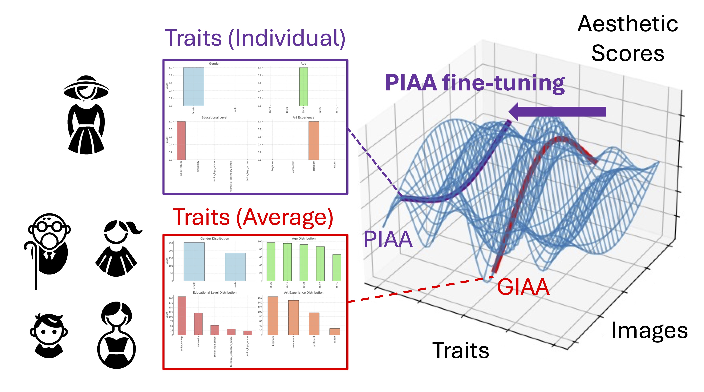

# Transfer Learning in IAA

<p align="center">
  
</p>


This repository provides code and models for experiments on **Generic Image Aesthetic Assessment (GIAA)**, **Subsampled GIAA (sGIAA)**, and **Personalized Image Aesthetic Assessment (PIAA)** using the PARA and LAPIS datasets.

---

## Installation

Clone the repository and set up the Conda environment:

```bash
git clone git@github.com:lwchen6309/aesthetics_transfer_learning.git
cd aesthetics_transfer_learning
conda env create -f environment.yaml
conda activate iaa_transfer
```

---

## Setup

Create the required directories for models and preprocessed data:

```bash
mkdir -p models_pth/random_cvs
mkdir -p LAPIS_dataset_pkl/user_cv
mkdir -p dataset_pkl/user_cv
```

---

## Datasets

### PARA

Download the PARA dataset from [here](https://cv-datasets.institutecv.com/#/data-sets).

Unzip `para_image_user_split.tar.gz` into a `PARA` folder with the following structure:

```
PARA
|-- annotation
|   |-- ARA-GiaaTest.csv
|   |-- PARA-GiaaTrain.csv
|   |-- PARA-Images.csv
|   |-- PARA-UserInfo.csv
|-- imgs
|   |-- *.jpg
|-- validation_images.txt
|-- userset
    |-- TrainUserIDs_Fold[1-4].txt
    |-- TestUserIDs_Fold[1-4].txt
```

### LAPIS

Download the LAPIS dataset from [here](git@github.com:Anne-SofieMaerten/LAPIS.git).

Unzip `lapis_image_user_split.tar.gz` into a `LAPIS` folder with the following structure:

```
LAPIS
|-- annotation
|   |-- LAPIS_individualratings_metaANDdemodata.csv
|-- images
|   |-- *.jpg
|-- imageset
|   |-- TrainImageSet.txt
|   |-- ValImageSet.txt
|   |-- TestImageSet.txt
|-- userset
    |-- TrainUserIDs_Fold[1-4].txt
    |-- TestUserIDs_Fold[1-4].txt
```

Set the dataset paths in `data_config.yaml`.

---

## Model Paths

```
models_pth
|-- random_cvs          # models trained with 4-fold cross validation
|   |-- *.pth
|-- *.pth               # models trained with native setup
```

---

## Running Models

### One-hot Encoded Models (GIAA, NIMA-Trait, PIAA-MIR, PIAA-ICI)

To train all models with all backbones (`resnet50`, `vit_small_patch16_224`, `swin_tiny_patch4_window7_224`) on both PARA and LAPIS datasets:

```bash
bash run.sh
```

### PIAA Baselines

#### Train GIAA Models

To access GIAA pretrained models, run:

```bash
python train_nima_attr.py --trainset GIAA
python train_nima_attr_lapis.py --trainset GIAA
```

#### Fine-tune PIAA-MIR and PIAA-ICI from GIAA Pretrained Models

```bash
trainargs='--trainset PIAA'

run_script="train_piaa_mir.py"
python $run_script $trainargs --pretrained_model path_to_pretrained_giaa

run_script="train_piaa_ici.py"
python $run_script $trainargs --pretrained_model path_to_pretrained_giaa

run_script="train_piaa_mir_lapis.py"
python $run_script $trainargs --pretrained_model path_to_pretrained_giaa

run_script="train_piaa_ici_lapis.py"
python $run_script $trainargs --pretrained_model path_to_pretrained_giaa
```

Replace `path_to_pretrained_giaa` with the correct checkpoint path.

---

## PIAA with Disjoint Users

### Split by 4-Fold Cross Validation

Use the following arguments:

```bash
--n_fold 4 --fold_id 1 --use_cv
```

Here `--fold_id` can be 1, 2, 3, or 4.

### Split by Demographics

You can run demographic-based splits using the provided scripts:

```bash
bash run_ptsplit.sh
bash run_ptsplit_lapis.sh
```

- To **train models** (on disjoint user groups), set:
  ```bash
  run_script="train_nima.py"
  run_script="train_piaa_mir.py"
  ```

- To **compute the Earth Mover’s Distance (EMD)** across demographic groups, use:
  ```bash
  run_script="compare_traitsample.py"
  ```

Here, the demographic group is specified with the `--trait` and `--values` arguments. For example:

```
# Photography Experience
python $run_script --trait photographyExperience --values beginner competent proficient expert $training_args
```

---

## License

This project is released under the **MIT License**.

---

## Citation

If you use this code or dataset, please cite:

```bibtex
@article{chen2025role,
  title={On the Role of Individual Differences in Current Approaches to Computational Image Aesthetics},
  author={Chen, Li-Wei and Strafforello, Ombretta and Maerten, Anne-Sofie and Tuytelaars, Tinne and Wagemans, Johan},
  journal={arXiv preprint arXiv:2502.20518},
  year={2025}
}
```

