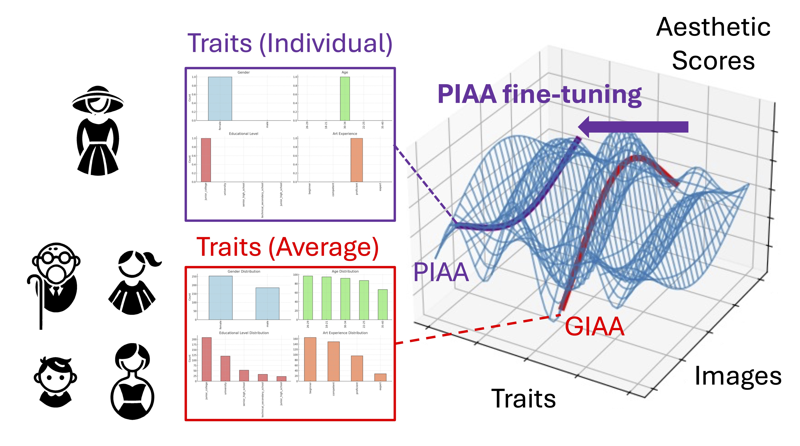

[](https://arxiv.org/abs/2502.20518)

# On the Role of Individual Differences in Current Approaches to Computational Image Aesthetics (BMVC 2025)

<p align="center">
  
</p>


This repository provides code and models for experiments on **Generic Image Aesthetic Assessment (GIAA)**, **Subsampled GIAA (sGIAA)**, and **Personalized Image Aesthetic Assessment (PIAA)** using the PARA and LAPIS datasets.

---

## Installation

Choose one setup path:

### Option A) Full training setup (Conda)

```bash
git clone git@github.com:lwchen6309/aesthetics_transfer_learning.git
cd aesthetics_transfer_learning
conda env create -f environment.yaml
conda activate iaa_transfer
```

### Option B) Pip-only inference setup

```bash
pip install unified-iaa
```

---

## Setup (for training workflows)

Create the required directories for models and preprocessed data:

```bash
mkdir -p models_pth/random_cvs
mkdir -p LAPIS_dataset_pkl/user_cv
mkdir -p dataset_pkl/user_cv
```

---

## Datasets

### PARA

Download the PARA dataset from [here](https://cv-datasets.institutecv.com/#/data-sets).

Unzip `para_image_user_split.tar.gz` into a `PARA` folder with the following structure:

```
PARA
|-- annotation
|   |-- ARA-GiaaTest.csv
|   |-- PARA-GiaaTrain.csv
|   |-- PARA-Images.csv
|   |-- PARA-UserInfo.csv
|-- imgs
|   |-- *.jpg
|-- validation_images.txt
|-- userset
    |-- TrainUserIDs_Fold[1-4].txt
    |-- TestUserIDs_Fold[1-4].txt
```

### LAPIS

Download the LAPIS dataset from [here](https://github.com/Anne-SofieMaerten/LAPIS).

Unzip `lapis_image_user_split.tar.gz` into a `LAPIS` folder with the following structure:

```
LAPIS
|-- annotation
|   |-- LAPIS_individualratings_metaANDdemodata.csv
|-- images
|   |-- *.jpg
|-- imageset
|   |-- TrainImageSet.txt
|   |-- ValImageSet.txt
|   |-- TestImageSet.txt
|-- userset
    |-- TrainUserIDs_Fold[1-4].txt
    |-- TestUserIDs_Fold[1-4].txt
```

Set the dataset paths in `data_config.yaml`.

---

## Model Paths

```
models_pth
|-- random_cvs          # models trained with 4-fold cross validation
|   |-- *.pth
|-- *.pth               # models trained with native setup
```

---

## Models

This section includes both **pip-based inference calls** and **training entry points**.

### Pip Inference Calls (4 examples)

Demographics/traits reference files (updated):

- PARA options: `hf_release/configs/demographics_options_para.json`
- LAPIS encoder/options: `hf_release/configs/demographics_options_lapis.json` (use listed encoder categories directly; no re-binning)
- PARA inference template: `hf_release/configs/para_demographics_template.json` (age must be interval bin: `18-21`, `22-25`, `26-29`, `30-34`, `35-40`)
- LAPIS inference template: `hf_release/configs/lapis_traits_template.json` (single LAPIS input object; SDK encodes internally)
- LAPIS input key list (no index): `hf_release/configs/lapis_input_keys.json`

#### 1) GIAA + PARA
```python
from unified_iaa import UnifiedIAA

m = UnifiedIAA.from_pretrained("stupidog04/Unified_IAA", device="cuda")  # or "cpu"
score = m.predict_giaa_prior(
    image="/path/to/image.jpg",
    task="GIAA",
    model="mir",
    backbone="vit_small_patch16_224",
)
print(score)
```

#### 2) PIAA + PARA
```python
from unified_iaa import UnifiedIAA

m = UnifiedIAA.from_pretrained("stupidog04/Unified_IAA", device="cuda")  # or "cpu"
score = m.predict_piaa(
    image="/path/to/image.jpg",
    demographics={
        "age": "30-34",
        "gender": "female",
        "EducationalLevel": "junior_college",
        "artExperience": "proficient",
        "photographyExperience": "proficient",
    },
    big5={
        "personality-E": 6,
        "personality-A": 7,
        "personality-N": 4,
        "personality-O": 8,
        "personality-C": 6,
    },
    task="PIAA",
    model="mir",
    backbone="vit_small_patch16_224",
)
print(score)
```

#### 3) GIAA + LAPIS
```python
from unified_iaa import UnifiedIAA

m = UnifiedIAA.from_pretrained("stupidog04/Unified_IAA", device="cuda")  # or "cpu"

lapis_input = {
    "nationality": "british",
    "demo_gender": "female",
    "demo_edu": "Bachelor's or equivalent",
    "demo_colorblind": "No",
    "age": "28-38",
    "VAIAK1": 3, "VAIAK2": 3, "VAIAK3": 3, "VAIAK4": 3, "VAIAK5": 3, "VAIAK6": 3, "VAIAK7": 3,
    "2VAIAK1": 3, "2VAIAK2": 3, "2VAIAK3": 3, "2VAIAK4": 3,
}

score = m.predict_lapis(
    image="/path/to/image.jpg",
    lapis_input=lapis_input,
    task="GIAA",
    model="mir",
    backbone="resnet50",
)
print(score)
```

#### 4) PIAA + LAPIS
```python
from unified_iaa import UnifiedIAA

m = UnifiedIAA.from_pretrained("stupidog04/Unified_IAA", device="cuda")  # or "cpu"

lapis_input = {
    "nationality": "british",
    "demo_gender": "female",
    "demo_edu": "Bachelor's or equivalent",
    "demo_colorblind": "No",
    "age": "28-38",
    "VAIAK1": 3, "VAIAK2": 3, "VAIAK3": 3, "VAIAK4": 3, "VAIAK5": 3, "VAIAK6": 3, "VAIAK7": 3,
    "2VAIAK1": 3, "2VAIAK2": 3, "2VAIAK3": 3, "2VAIAK4": 3,
}

score = m.predict_lapis(
    image="/path/to/image.jpg",
    lapis_input=lapis_input,
    task="PIAA",
    model="mir",
    backbone="resnet50",
)
print(score)
```

### Training: One-hot Encoded Models (GIAA, NIMA-Trait, PIAA-MIR, PIAA-ICI)

To train all models with all three backbones (`resnet50`, `vit_small_patch16_224`, `swin_tiny_patch4_window7_224`) on both PARA and LAPIS:

```bash
bash run.sh
```

### Training: PIAA Baselines

#### 1) Train GIAA models

To train/access GIAA pretrained models on PARA, run:

```bash
python train_nima_attr.py --trainset GIAA
```

#### 2) Fine-tune PIAA-MIR and PIAA-ICI from GIAA pretrained models

```bash
trainargs='--trainset PIAA'

run_script="train_piaa_mir.py"
python $run_script $trainargs --pretrained_model path_to_pretrained_giaa

run_script="train_piaa_ici.py"
python $run_script $trainargs --pretrained_model path_to_pretrained_giaa

run_script="train_piaa_mir_lapis.py"
python $run_script $trainargs --pretrained_model path_to_pretrained_giaa

run_script="train_piaa_ici_lapis.py"
python $run_script $trainargs --pretrained_model path_to_pretrained_giaa
```

Replace `path_to_pretrained_giaa` with the correct checkpoint path.

---

## PIAA with Disjoint Users

### Split by 4-Fold Cross Validation

Use the following arguments:

```bash
--n_fold 4 --fold_id 1 --use_cv
```

Here `--fold_id` can be 1, 2, 3, or 4.

### Split by Demographics

You can run demographic-based splits using the provided scripts:

```bash
bash run_ptsplit.sh
bash run_ptsplit_lapis.sh
```

- To **train models** (on disjoint user groups), set:
  ```bash
  run_script="train_nima.py"
  run_script="train_piaa_mir.py"
  ```

- To **compute the Earth Mover’s Distance (EMD)** across demographic groups, use:
  ```bash
  run_script="compare_traitsample.py"
  ```

Here, the demographic group is specified with the `--trait` and `--values` arguments. For example:

```
# Photography Experience
python $run_script --trait photographyExperience --values beginner competent proficient expert $training_args
```

---

## License

This project is released under the **MIT License**.

---

## Citation

If you use this code, please cite:

```bibtex
@article{chen2025role,
  title={On the Role of Individual Differences in Current Approaches to Computational Image Aesthetics},
  author={Chen, Li-Wei and Strafforello, Ombretta and Maerten, Anne-Sofie and Tuytelaars, Tinne and Wagemans, Johan},
  journal={arXiv preprint arXiv:2502.20518},
  year={2025}
}
```

